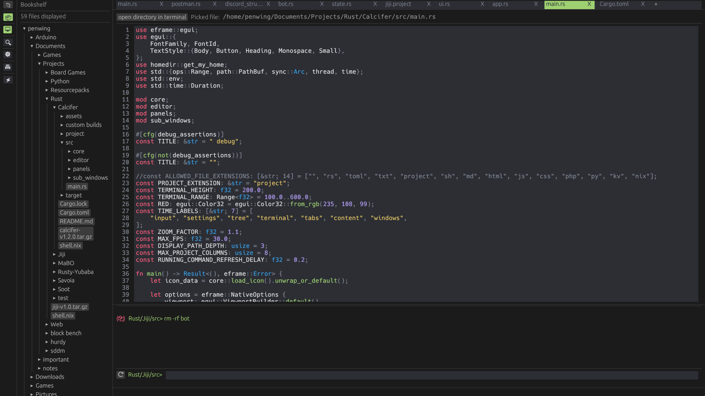

# Calcifer

My custom code editor (only the features I want inside) using egui and a fork of egui_code_editor https://lib.rs/crates/egui_code_editor  
  
# GUI
using egui to have immediate mod rendering (so the app is using very few processing power when not interacted with)  

# Screenhot

# Features
- find and replace
- undo/redo
- syntax highlighting (asm, js, lua, py, rust, shell, sql)
- simple themes
- tabs
- file tree  
- terminal
- a very crude project mode (kanban)

# Performances
best case (empty) / use case (12 files open, average of 210 lines, selected file 340 lines, terminal and file tree open)  

ram usage : 109 MB / 112 MB 
  
frame calculation time : 0.4ms / 1ms  with a Ryzen 7 3700U
  
calcifer is capped at 30 FPS (max 1 frame every 33.3ms) but 0 FPS when not interacted with
  
that way it is very light on the processor as well

